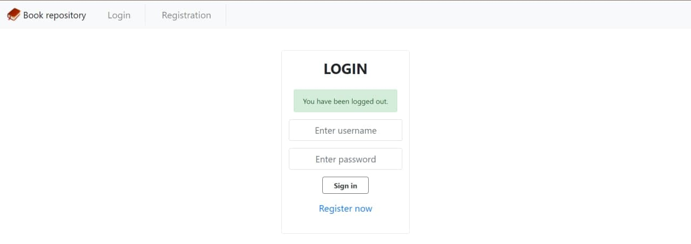
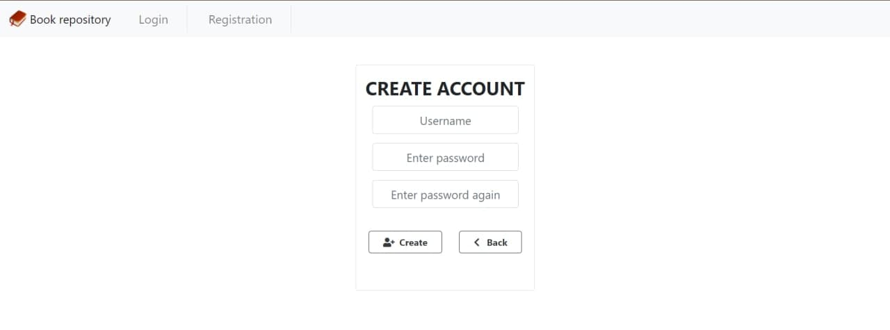
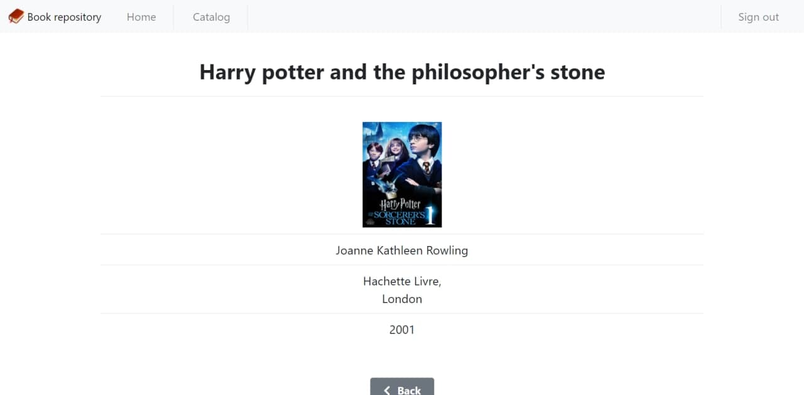
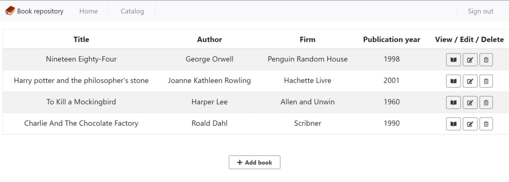

<h1 align="center">Book repository</h1>

<p align="center">
Spring boot application which keeps your favourite books in one place
</p>


### Built With

* [Spring boot](https://spring.io/projects/spring-boot)
* [MySQL](https://www.mysql.com/)
* [Thymeleaf](https://www.thymeleaf.org/)


### How to run?


1. Clone the repo
   ```sh
   git clone https://github.com/vanyaadev/book-repository.git
   ```
2. Import maven dependencies
 
3. Enter your database URI in `application.properties`
   ```
   spring.datasource.url=Change to yours
   spring.datasource.username=Change to yours
   spring.datasource.password=Change to yours

   ```
5. Run application
6. Server will run on localhost:8080


### Screenshots of the project






<!-- CONTACT -->
## Contact

Ivan Dietskov - [Facebook](https://www.facebook.com/vanyaaboss/) - detskov5@gmail.com

Project Link: [https://github.com/vanyaadev/book-repository](https://github.com/vanyaadev/book-repository)
